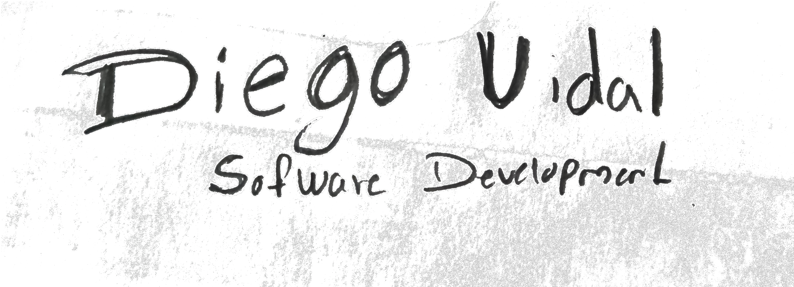

<a name="readme-top"></a>
<div align="center">
  <!-- You are encouraged to replace this logo with your own! Otherwise you can also remove it. -->
  
  <br/>

  <h3><b>Leaderboard website</b></h3>

</div>

<!-- TABLE OF CONTENTS -->

# 📗 Table of Contents

- [📖 About the Project](#about-project)
  - [🛠 Built With](#built-with)
    - [Tech Stack](#tech-stack)
    - [Key Features](#key-features)
  - [🚀 Live Demo](#live-demo)
- [💻 Getting Started](#getting-started)
  - [Prerequisites](#prerequisites)
  - [Setup](#setup)
  - [Install](#install)
  - [Usage](#usage)
  - [Run tests](#run-tests)
  - [Deployment](#deployment)
- [👥 Authors](#authors)
- [🔭 Future Features](#future-features)
- [🤝 Contributing](#contributing)
- [⭐️ Show your support](#support)
- [🙏 Acknowledgements](#acknowledgements)
- [❓ FAQ (OPTIONAL)](#faq)
- [📝 License](#license)

<!-- PROJECT DESCRIPTION -->

# 📖 Leaderboard <a name="about-project"></a>

> What is the Leaderboard?

**The Leaderboard** website displays scores submitted by different players. It also allows you to submit your score. All data is preserved thanks to the external Leaderboard API service [Leaderboard API service](https://microverse.notion.site/Leaderboard-API-service-24c0c3c116974ac49488d4eb0267ade3).

## 🛠 Built With <a name="built-with"></a>

### Tech Stack <a name="tech-stack"></a>

> Tech stack and  relevant sections:

<details>
  <summary>Client</summary>
  <ul>
    <li><a href="https://developer.mozilla.org/en-US/docs/Web/HTML">HTML</a></li>
    <li><a href="https://developer.mozilla.org/en-US/docs/Web/CSS">CSS</a></li>
    <li><a href="https://developer.mozilla.org/en-US/docs/Web/JavaScript">JavaScript</a></li>
  </ul>
</details>

<details>
  <summary>API</summary>
  <ul>
    <li><a href="https://microverse.notion.site/Leaderboard-API-service-24c0c3c116974ac49488d4eb0267ade3">Leaderboard API service</a></li>
  </ul>
</details>

<!-- Features -->

### Key Features <a name="key-features"></a>

>  Key features of the application.

- **Preserves user input**
- **Make use of an API**
- **Refresh button**
- **Submit button**
- **Make use of async functions and await keyword**

<p align="right">(<a href="#readme-top">back to top</a>)</p>

<!-- LIVE DEMO -->

## 🚀 Live Demo <a name="live-demo"></a>

> Link to deployed version:

- [We are still working on this feature...](https://google.com)

<p align="right">(<a href="#readme-top">back to top</a>)</p>

<!-- GETTING STARTED -->

## 💻 Getting Started <a name="getting-started"></a>

> How a new developer could make use of the project?

To get a local copy up and running, follow these steps.

### Prerequisites

In order to run this project you need:

- node 
- npm
- a code editor

### Setup

Clone this repository to your desired folder:

```sh
  cd my-folder
  git clone git@github.com:Diegogagan2587/Leaderboard.git
```
### Install

Install this project with:

```sh
  cd Leaderboard
  npm install
```


### Usage

To run the project in your local environment, execute the following command:

```sh
  npm run start
```


### Run tests

No test available yet.

### Deployment

If you want to deploy your own version of this project you can do so by 
using [github pages](https://pages.github.com/)

<p align="right">(<a href="#readme-top">back to top</a>)</p>

<!-- AUTHORS -->

## 👥 Authors <a name="authors"></a>

> Collaborators of this project.

👤 **Dievo Vidal Lopez**

- GitHub: [@Diegogagan2587](https://github.com/Diegogagan2587)
- Twitter: [@dieg02587](https://twitter.com/dieg02587)
- LinkedIn: [Diego Vidal Lopez](https://www.linkedin.com/in/diego-vidal2587/?locale=en_US)

<p align="right">(<a href="#readme-top">back to top</a>)</p>

<!-- FUTURE FEATURES -->

## 🔭 Future Features <a name="future-features"></a>

> coming soon features:

- [ ] **Send adn receive data from API**
- [ ] **Styling final touches**

<p align="right">(<a href="#readme-top">back to top</a>)</p>

<!-- CONTRIBUTING -->

## 🤝 Contributing <a name="contributing"></a>

Contributions, issues, and feature requests are welcome!

Feel free to check the [issues page](https://github.com/Diegogagan2587/Leaderboard/issues).

<p align="right">(<a href="#readme-top">back to top</a>)</p>

<!-- SUPPORT -->

## ⭐️ Show your support <a name="support"></a>

> Would you like to support?

Let me know at diego27796gagan@gmail.com

<p align="right">(<a href="#readme-top">back to top</a>)</p>

<!-- ACKNOWLEDGEMENTS -->

## 🙏 Acknowledgments <a name="acknowledgements"></a>

> Give credit to everyone who inspired your codebase.

I would like to thank to the Microverse team for suggesting to me to complete this project in order to improve my learning.

<p align="right">(<a href="#readme-top">back to top</a>)</p>

<!-- LICENSE -->

## 📝 License <a name="license"></a>

This project is [MIT](./LICENSE) licensed.

<p align="right">(<a href="#readme-top">back to top</a>)</p>
